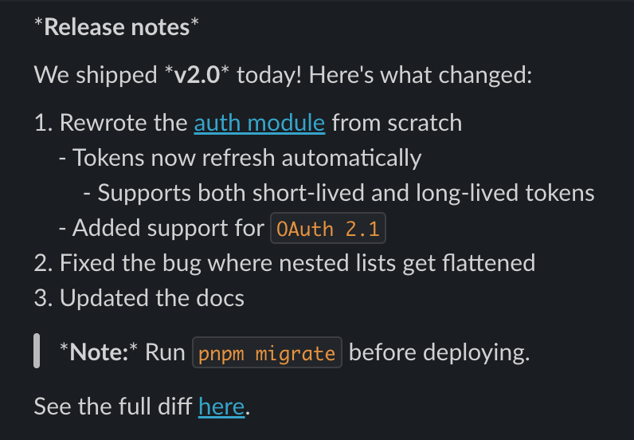
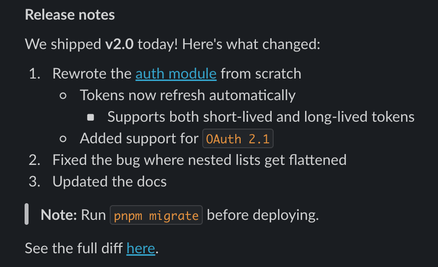

# #slackfmt

**Paste Markdown into Slack. For real this time.**

You know the drill. You spend 5 minutes crafting a perfectly formatted message: nested lists, labeled links,
code blocks, and paste it into Slack.

Slack looks at your formatting, says "lol no", and turns it into a wall of plain text with some random asterisks.

`slackfmt` fixes this. It converts your Markdown (or HTML) into Slack's native rich text clipboard format, so when you paste,
everything comes through exactly as you wrote it: **bold**, _italic_, `code`, [links](https://actually-work.com), nested lists, blockquotes, all of it.

| Pasted directly | Pasted with slackfmt |
| --- | --- |
|  |  |

## Quick start

### Web

Paste your Markdown at **[slackfmt.labs.caue.dev](https://slackfmt.labs.caue.dev)**, hit Copy, paste into Slack. Done.

### CLI

```sh
# pipe it
echo "**bold** and _italic_" | npx @slackfmt/cli@latest

# from a file
cat meeting-notes.md | npx @slackfmt/cli@latest

# html too
npx @slackfmt/cli@latest -f html < page.html
```

Copies to clipboard by default. Use `--stdout` to print instead.

Supported formats (`-f`): `markdown` (default), `html`, `slack-html`, `quill-delta`.

### AI agent skill

Give your AI agent the power to format for Slack:

```sh
npx skills add https://github.com/cauethenorio/slackfmt --skill slackfmt
```

Works with [Claude Code](https://docs.anthropic.com/en/docs/claude-code) and other agents. Ask it to "format X for Slack" and it pipes content through slackfmt automatically.

## How does this even work?

Slack's compose bar is secretly a [Quill](https://quilljs.com/) editor. When you paste, Slack doesn't just read plain text. It looks for a `slack/texty` entry hidden inside a Chromium custom MIME type (`org.chromium.web-custom-data`) on your clipboard.

slackfmt exploits this by:

1. Converting your input to [Quill Delta](https://quilljs.com/docs/delta/) JSON
2. Packing the Delta into a [Chromium Pickle](https://source.chromium.org/chromium/chromium/src/+/main:base/pickle.h) binary blob tagged as `slack/texty`
3. Writing it to the system clipboard via a native Rust addon

When you paste, Slack reads the custom data and thinks you're pasting from Slack itself. Bold, italic, nested lists, code blocks, links, blockquotes, all come through intact.

Yes, it's a hack. A beautiful, beautiful hack.

## Packages

| Package | Description |
| --- | --- |
| [@slackfmt/core](packages/core) | Markdown/HTML to Quill Delta conversion engine |
| [@slackfmt/cli](packages/cli) | Command-line interface with clipboard integration |
| [@slackfmt/clipboard](packages/clipboard) | Native clipboard writer (Rust) |
| [@slackfmt/web](packages/web) | Browser-based editor with live preview |

## License

MIT
